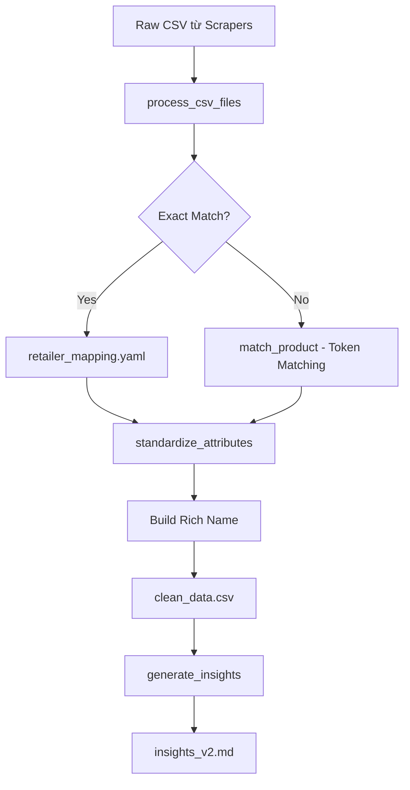

# Catalog & Normalization System Documentation

> Tài liệu phân tích toàn bộ quá trình chuẩn hóa tên sản phẩm trong hệ thống Daily Promotion

---

## 📁 Cấu Trúc Thư Mục `catalog/`

```
catalog/
├── product_catalog.yaml       # Master catalog (2837 lines, ~100 products)
├── retailer_mapping.yaml      # Explicit name → key mapping (393 lines, ~350 mappings)
├── standards.md               # Naming conventions documentation
├── apple_official_catalog.json # Apple official product list (source data)
└── output/
    ├── clean_data_YYYY-MM-DD.csv    # Normalized daily data
    ├── normalized_mapping_YYYY-MM-DD.csv
    └── unmatched_products_YYYY-MM-DD.csv
```

---

## 🔄 Data Flow Pipeline



---

## 📚 File Descriptions

### 1. `product_catalog.yaml` - Master Product Catalog

**Mục đích:** Định nghĩa tất cả sản phẩm Apple với properties chuẩn.

**Cấu trúc:**
```yaml
iphone_16_pro_max:
  name: iPhone 16 Pro Max           # Tên chuẩn
  category: iPhone                   # Phân loại
  url: https://apple.com/...        # Link chính hãng
  colors:                           # Màu hợp lệ
    - Titan Sa Mạc
    - Titan Trắng
    - Titan Tự Nhiên
  storage:                          # Dung lượng hợp lệ
    - 256GB
    - 512GB
    - 1TB
  sizes:                            # Kích thước (cho Watch/iPad)
    - 6.9 inch
  connectivity:                     # GPS/Cellular (cho Watch)
    - GPS
    - GPS + Cellular
  keywords:                         # Keywords bổ sung cho matching
    - Titan
    - Titanium
```

**Thống kê:**
- **~100 product keys** (iPhone, iPad, Mac, Watch, Audio)
- Categories: `iPhone`, `iPad`, `Mac`, `Watch`, `Audio`

---

### 2. `retailer_mapping.yaml` - Explicit Name Mappings

**Mục đích:** Map chính xác tên sản phẩm từ từng retailer sang product_key.

**Cấu trúc:**
```yaml
CellphoneS:
  "iPhone 16 Pro Max 256GB": iphone_16_pro_max
  "Apple Watch SE 3 40mm (GPS) Viền Nhôm Dây Cao Su Size S/M": apple_watch_se_3_gps
  
Mobile World:
  "iPhone 16 Pro Max 256GB": iphone_16_pro_max
  
FPT Shop:
  "iPhone 16 Pro Max 256GB": iphone_16_pro_max
```

**Thống kê:**
- **6 retailers:** CellphoneS, Di Động Việt, FPT Shop, HoangHa, Mobile World, Viettel Store
- **~350 explicit mappings**
- Ưu tiên cao nhất trong matching

---

### 3. `normalize.py` - Core Processing Engine

**Location:** `src/processing/normalize.py` (889 lines)

#### Key Functions:

| Function | Lines | Purpose |
|----------|-------|---------|
| `load_catalog()` | 30-32 | Load product_catalog.yaml |
| `load_retailer_mapping()` | 107-110 | Load retailer_mapping.yaml |
| `match_product()` | 112-189 | Find product_key from raw name |
| `standardize_attributes()` | 217-316 | Extract size/color/connectivity |
| `process_csv_files()` | 318-453 | Main processing loop |
| `generate_insights()` | 616-785 | Generate markdown insights |

---

## 🔍 Matching Algorithm Detail

### Step 1: Exact Match (Priority 1)

```python
# retailer_mapping.yaml lookup
if retailer_name and retailer_mapping and retailer_name in retailer_mapping:
    mapped_key = retailer_mapping[retailer_name].get(str(row_name).strip())
    if mapped_key:
        return mapped_key  # ✅ Trả về ngay, không cần fuzzy match
```

**Ưu điểm:** Chính xác 100%, không có sai lệch.

**Nhược điểm:** Cần maintain danh sách đầy đủ (~350 entries hiện tại).

---

### Step 2: Token-Based Matching (Fallback)

```python
# Tokenize raw name
row_name_norm = normalize_text(row_name)  # lowercase, remove accents
name_tokens = set(row_name_norm.split())

# Compare with each catalog entry
for key, info in catalog.items():
    cat_tokens = set(normalize_text(info['name']).split())
    
    # NEGATIVE CHECKS - Prevent cross-category matches
    if category == 'Watch':
        if 'iphone' in row_full_lower: continue  # Skip!
    
    # TOKEN MATCHING
    if cat_tokens.issubset(full_tokens):  # All catalog tokens in product
        # Calculate score
        score = (match_type, len(cat_tokens))  # Prioritize specificity
```

**Scoring:**
1. **Keyword match** → score = 2 (highest)
2. **Name subset** → score = 1
3. **Specs subset** → score = 0

**Ví dụ:**
```
Raw: "Apple Watch SE 3 40mm GPS Nhôm Bạc"
Catalog: "Apple Watch SE 3 (GPS)" → Tokens: {apple, watch, se, 3, gps}
Match: ✅ All tokens found in raw name
```

---

### Step 3: Attribute Standardization

```python
std_attrs = standardize_attributes(product_key, raw_text, catalog)
# Returns: {
#   'size': '42mm',
#   'connectivity': 'GPS + Cellular',
#   'color': 'Nhôm Bạc',
#   'band': 'Dây Cao Su'
# }
```

**Logic cho từng attribute:**

| Attribute | Matching Logic |
|-----------|---------------|
| **Size** | Regex: `42mm`, `13.6 inch`, etc. against `valid_sizes` |
| **Connectivity** | Keywords: `cellular`, `5g`, `lte` → GPS + Cellular |
| **Color** | Token overlap: `Nhôm Bạc` matches "Bạc" |
| **Band** | Keywords: `alpine`, `ocean`, `trail`, `cao su` |

---

## 🏗️ Product Name Construction

### Formula:
```
[Catalog Name] + [Size] + ([Connectivity]) + [Color] + [Storage] + [Band] + [Extra Specs]
```

### Examples:

| Raw Name | Constructed Name |
|----------|-----------------|
| `Apple Watch SE 3 40mm GPS Nhôm Bạc` | `Apple Watch SE 3 (GPS) 40mm (GPS) Nhôm Bạc Dây Cao Su` |
| `iPhone 16 Pro Max 256GB Titan Sa Mạc` | `iPhone 16 Pro Max Titan Sa Mạc 256gb` |
| `MacBook Pro 14 M4 24GB 1TB` | `MacBook Pro M4 14 inch 1tb 24GB` |

---

## ⚠️ Known Issues & Improvement Areas

### Issue 1: Duplicate/Inconsistent Product Names

**Problem:** Same product mapped to different keys across retailers.

```
CellphoneS: "Apple Watch SE 3 40mm" → apple_watch_se_3_gps
FPT Shop: "Apple Watch SE 2024 40mm" → apple_watch_se  # OLD KEY!
```

**Impact:** Trend analysis groups them separately → inaccurate insights.

**Solution:** Audit `retailer_mapping.yaml` for consistency.

---

### Issue 2: Missing retailer_mapping Entries

**Problem:** ~18 unmatched products per day (see `unmatched_err.csv`).

**Current unmatched:**
- New products not in catalog
- Product name format changes
- Bundles/accessories

**Solution:** Auto-update `retailer_mapping.yaml` from unmatched products.

---

### Issue 3: Color/Size Standardization Inconsistencies

**Problem:** Same color mapped differently.

```
Raw: "Đen"   → Mapped: "Titan Đen" (wrong for iPhone 16e)
Raw: "Đen"   → Should be: "Đen" (simple black)
```

**Solution:** Per-product color validation against `catalog[key].colors`.

---

### Issue 4: Watch Product Naming Complexity

**Problem:** Watch names have many variants:
- Size: 40mm, 42mm, 44mm, 46mm, 49mm
- Connectivity: GPS, GPS + Cellular
- Material: Nhôm, Titan, Titanium
- Band: Cao Su, Vải, Alpine, Ocean, Trail

**Current name construction duplicates info:**
```
"Apple Watch SE 3 (GPS) 40mm (GPS) Nhôm Bạc Dây Cao Su"
                 ↑ duplicate ↑
```

**Solution:** Smarter deduplication in `process_csv_files()`.

---

## 📊 Metrics (Current State)

| Metric | Value |
|--------|-------|
| Products in catalog | ~100 |
| Explicit mappings | ~350 |
| Match rate | ~99.6% (18 unmatched / 4991 total) |
| Categories | 5 (iPhone, iPad, Mac, Watch, Audio) |
| Retailers | 6 |
| Historical data | 58 days in `data/raw/` |

---

## 🛠️ Recommended Improvements

### Priority 1: Audit retailer_mapping.yaml
- [ ] Ensure consistent product keys across all retailers
- [ ] Add missing Watch variants
- [ ] Remove duplicate/outdated entries

### Priority 2: Auto-Update Pipeline
- [ ] Script to detect unmatched products
- [ ] Suggest mappings based on fuzzy match
- [ ] Review queue for manual approval

### Priority 3: Validation Layer
- [ ] Validate color against catalog colors
- [ ] Validate storage against catalog storage
- [ ] Log warnings for mismatches

### Priority 4: Testing
- [ ] Unit tests for `match_product()`
- [ ] Integration tests with sample data
- [ ] Regression tests for name construction

---

## 📁 Related Files

| File | Purpose |
|------|---------|
| [normalize.py](file:///Users/brucehuynh/GitHub/daily-promotion/src/processing/normalize.py) | Main processing engine |
| [product_catalog.yaml](file:///Users/brucehuynh/GitHub/daily-promotion/catalog/product_catalog.yaml) | Master product definitions |
| [retailer_mapping.yaml](file:///Users/brucehuynh/GitHub/daily-promotion/catalog/retailer_mapping.yaml) | Explicit name mappings |
| [standards.md](file:///Users/brucehuynh/GitHub/daily-promotion/catalog/standards.md) | Naming conventions |

---

*Generated: 2026-02-01*
