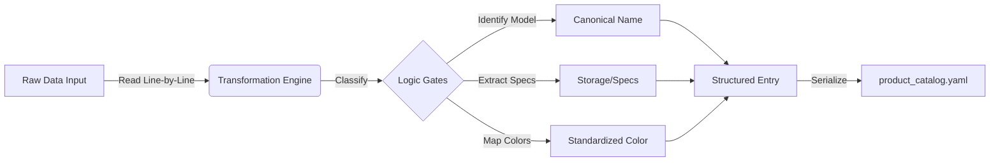

# 🧠 Product Catalog Pipeline (Data Engineering)

**Last Updated:** 2026-01-31
**Status:** Evaluation / Porting

This document outlines the automated pipeline used to transform raw market data into the structured knowledge base (`product_catalog.yaml`). 
*Originally adapted from the `iPhone-Youtube` project for `daily-promotion`.*

## 1. Executive Summary
*   **Goal**: Normalize thousands of non-standard product names (e.g., "iPhone 16 Pro Max 256GB VN/A Titan Sa Mạc") into a clean, queryable database.
*   **Methodology**: **Deterministic Rule-Based System** (Python).
*   **AI Agent Usage**: ❌ **NO**.
    *   *Reason*: We prioritize **100% accuracy** and **speed** (O(n)) over creativity for this specific task. Regular Expressions (Regex) are safer than LLMs for structured data normalization.

## 2. Pipeline Architecture



### 3. File Reference (Full Paths)

| Role | File Path | Usage |
| :--- | :--- | :--- |
| **Source (Daily)** | `content/YYYY-MM-DD/*.csv` | Structured market data (prices/names) scraped daily. |
| **Aggregator** | *(To be ported)* | Extracting unique names from daily data. |
| **Input (Intermediate)** | `analysis/reference/unique_products_list.txt` | Raw list of product names scraped from e-commerce sites. |
| **Logic (Engine)** | *(To be ported / part of analysis scripts)* | The Python script containing the Regex rules and dictionaries. |
| **Output (DB)** | `analysis/reference/product_catalog.yaml` | The final structured database used by the system. |

## 4. Detailed Process Flow

### Step 0: Data Aggregation (Optional refresh)
The system aggregates all product names seen in the market scans.
*   *Script*: `src/tools/extract_unique_products.py` (To be implemented)
*   *Output*: `unique_products_list.txt`

### Step 1: Ingestion
The system reads `unique_products_list.txt`.
*   *Input Example*: `"iPhone 16 Pro Max 256GB - VN/A Titan Sa Mạc"`

### Step 2: Classification (The "Logic Gates")
The script applies a waterfall classification strategy:

1.  **Category Detection**:
    *   If `watch` in string -> `Category: watch`
    *   If `macbook` in string -> `Category: mac`
    *   If `iphone` in string -> `Category: iphone`

2.  **Canonical Normalization**:
    *   It looks for specific substrings to assign a clean ID.
    *   *Rule*: `if "16 pro max" in raw_name -> Name = "iPhone 16 Pro Max"`

3.  **Spec Extraction (Regex)**:
    *   It extracts storage using patterns like `(\d+)gb` or `(\d+)tb`.
    *   *Result*: `256gb`

4.  **Color Standardization (Dictionary Mapping)**:
    *   It maps various spellings to a standard format.
    *   *Mapping*: `["desert titanium", "titan sa mạc", "titan vang"]` -> **"Titan Sa Mạc"**.

### Step 3: Serialization
Final data is keyed by a `snake_case` identifier for O(1) lookup speed.

```yaml
# Result in product_catalog.yaml
iphone_16_pro_max_256gb_titan_sa_mac:
  category: "iphone"
  colors:
    - "Titan Sa Mạc"
  name: "iPhone 16 Pro Max (256gb)"
  variants:
    - "iPhone 16 Pro Max 256GB - VN/A Titan Sa Mạc"
```

## 5. Integration
This catalog is **Read-Only** for the AI Agents.
*   The AI uses this "Ground Truth" to know exactly what products exist, preventing hallucinations.
