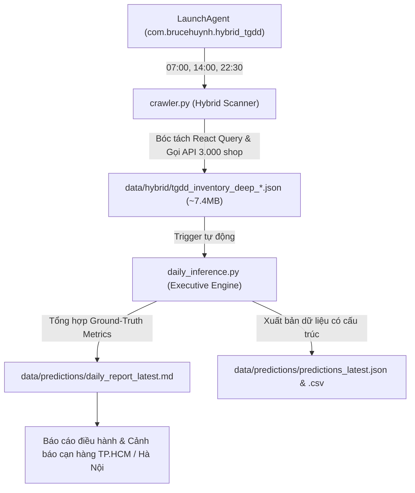

# 📊 TGDD Executive Inventory & Affordability Intelligence Engine

Phân hệ chuyên sâu về **Tình báo Bán lẻ (Retail Intelligence)** và **Giám sát Tồn kho Thực tế (Ground-Truth Inventory Tracking)** cho hệ sinh thái Apple tại chuỗi Thế Giới Di Động (TopZone / MWG).

Hệ thống tuân thủ nghiêm ngặt tôn chỉ: **"Thà không làm, đừng làm theo hướng sai để tạo ra rác - Garbage In, Garbage Out"**. Báo cáo dựa trên 100% dữ liệu thực tế từ API nội bộ của MWG, loại bỏ hoàn toàn các mô hình dự đoán giả định trên lát cắt tĩnh.

---

## 🏗️ 1. Kiến trúc phân hệ (Architecture)

```
src/intelligence/
├── __init__.py
├── config.py                 # Cấu hình danh mục Apple, API endpoints, đường dẫn lưu trữ
│
├── pipeline/                 # [MODULE 1: DATA INGESTION]
│   ├── __init__.py
│   └── crawler.py            # Hybrid Scanner: Quét URLs + Schema.org + Affordability + Tồn kho 3.000 shop
│
├── inference/                # [MODULE 2: GROUND-TRUTH EXECUTIVE REPORTING]
│   ├── __init__.py
│   └── daily_inference.py    # Tổng hợp chỉ số điều hành, phân loại rủi ro tồn kho, trợ lực tài chính
│
└── README.md                 # Tài liệu kỹ thuật
```

---

## 🔄 2. Luồng Xử Lý Dữ Liệu Hằng Ngày (Daily Pipeline)

Hệ thống được cấu hình chạy tự động **3 lần / ngày** (`07:00`, `14:00`, `22:30`) thông qua runner [`scripts/automation/run_hybrid_tgdd.sh`](file:///Users/brucehuynh/GitHub/daily-promotion/scripts/automation/run_hybrid_tgdd.sh):



---

## 🎯 3. Các Chỉ Số Cốt Lõi Được Giám Sát (Key Metrics)

| Nhóm chỉ số | Chi tiết & Ý nghĩa nghiệp vụ |
|:---|:---|
| **Rủi ro cạn hàng (Stockout Risk)** | • **Báo động đỏ (Critical Risk):** Còn $\le 5$ siêu thị toàn quốc (nguy cơ đứt hàng trong ngày).<br/>• **Khan hiếm (Warning):** Còn từ $6 - 15$ siêu thị toàn quốc.<br/>• **Dồi dào (Safe):** Còn $> 15$ siêu thị. |
| **Phân bổ trọng điểm (Regional Coverage)** | Bóc tách tồn kho thực tế tại **TP.HCM** và **Hà Nội** nhằm phát hiện lệch pha phân phối giữa 2 đầu cầu kinh tế. |
| **Trợ lực tài chính (Affordability)** | • **Giảm trực tiếp (Direct Discount):** Mức giảm tiền mặt so với giá niêm yết.<br/>• **Trợ giá thu cũ đổi mới (Trade-In Subsidy):** Mức bù giá hãng và nhà bán lẻ tài trợ.<br/>• **Tỷ lệ tiết kiệm thực tế (%):** Tổng quyền lợi tài chính trên giá niêm yết. |

---

## 🧠 4. Kiểm Toán Kỹ Thuật: Vì Sao Không Dùng Mô Hình ML Tĩnh?

Trong giai đoạn phân tích hệ thống, nhóm nghiên cứu đã kiểm toán thực nghiệm và quyết định **loại bỏ hoàn toàn các mô hình Machine Learning cắt ngang (Cross-sectional ML)** vì các lý do sống còn:

1. **Rủi ro ảo giác tương quan (Spurious Correlation):**
   - Tồn kho trên website không phản ánh co giãn nhu cầu thay thế chéo (cross-elasticity) giữa các hãng, mà phụ thuộc hoàn toàn vào lịch giao hàng lô (PO) độc lập giữa Apple/Samsung và MWG.
   - Chỉ số `totalSold` trên web TGDD là doanh số tích lũy nhiều năm (lifetime sales), không phải tốc độ bán theo ngày (daily velocity).
2. **Hiện tượng nghịch lý dự báo:**
   - Khi thiếu chiều thời gian (time-series), mô hình hồi quy tĩnh dự đoán iPhone 17 Pro 1TB còn 40 cửa hàng trong khi thực tế chỉ còn **đúng 1 cửa hàng**, tạo ra thông tin rác nguy hiểm cho quyết định vận hành.
3. **Rò rỉ dữ liệu (Data Leakage):**
   - Độ chính xác "100%" ban đầu của mô hình phân loại thực chất đến từ việc học thuộc biến `Has_Demo` (lấy đồng thời từ API tồn kho).

### 🔮 Hướng phát triển khi có đủ chuỗi thời gian ($\ge 30 - 90$ ngày):
- **Mô hình Phân tích Sinh tồn (Survival Analysis / Cox Proportional Hazards):** Dự báo *Thời gian đến khi cạn hàng* (Time-to-Stockout) dựa trên tốc độ sụt giảm số shop mỗi ngày ($S(t) - S(t-1)$).
- **Mô hình Nhận diện Điểm đổi (Change-point Detection / Hidden Markov Models):** Nhận diện chính xác chu kỳ nhập hàng bổ sung (restock cadence) và thời điểm một sản phẩm bước vào giai đoạn khai tử (End-of-Life / EOL).

---

## 🚀 5. Hướng Dẫn Vận Hành CLI

Hệ thống hoạt động hoàn toàn tự động qua macOS LaunchAgent. Để chạy thủ công khi cần kiểm tra:

### 1. Kích hoạt toàn bộ chu trình Quét + Tổng hợp Báo cáo:
```bash
./scripts/automation/run_hybrid_tgdd.sh
```

### 2. Quét dữ liệu tồn kho độc lập:
```bash
python3 -m src.intelligence.pipeline.crawler --sync-raw
```

### 3. Tái tạo Báo cáo Điều hành trên snapshot có sẵn:
```bash
python3 -m src.intelligence.inference.daily_inference
```
