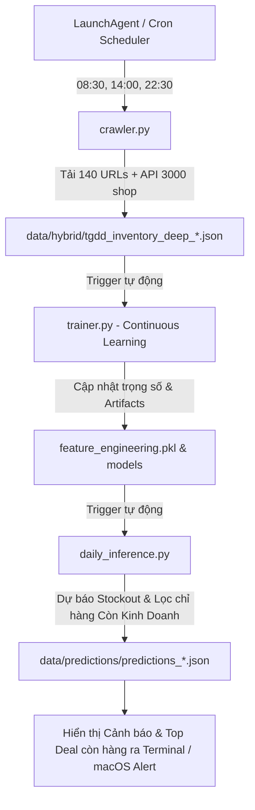

# 🧠 TGDD Retail Intelligence & AI Forecasting Engine

Phân hệ con (Subproject) chuyên sâu về **Trí tuệ Bán lẻ (Retail Intelligence)** và **Mô hình Dự báo Máy học (AI/ML Demand & Stock Forecasting)** cho hệ sinh thái Apple tại chuỗi Thế Giới Di Động (TopZone / MWG).

---

## 🏗️ 1. Kiến trúc phân hệ (Architecture)

```
src/intelligence/
├── __init__.py
├── config.py                 # Cấu hình danh mục, endpoints, feature lists, đường dẫn
│
├── pipeline/                 # [MODULE 1: DATA INGESTION]
│   ├── __init__.py
│   └── crawler.py            # Hybrid Scanner: Quét URLs + Schema.org + Affordability + Tồn kho 3.000 shop
│
├── features/                 # [MODULE 2: FEATURE ENGINEERING]
│   ├── __init__.py
│   └── feature_engineering.py# Trích xuất đặc trưng miền, OHE (Category, Color, Gen), Numeric Scaling
│
├── models/                   # [MODULE 3: MODEL TRAINING]
│   ├── __init__.py
│   ├── trainer.py            # Huấn luyện StockOutClassifier (RF) & StoreDistributionRegressor (RF)
│   └── saved_models/         # Lưu trữ trọng số mô hình (.pkl)
│       ├── feature_engineer.pkl
│       ├── stockout_classifier.pkl
│       └── store_regressor.pkl
│
├── inference/                # [MODULE 4: DAILY INFERENCE & SCORING]
│   ├── __init__.py
│   └── daily_inference.py    # Nạp snapshot mới nhất, chạy dự báo, cảnh báo rủi ro & cơ hội
│
└── README.md                 # Tài liệu kỹ thuật
```

---

## 📊 2. Luồng Dữ liệu & MLOps Hằng Ngày (Daily Dataflow)

Hệ thống được cấu hình chạy tự động **3 lần / ngày** (`08:30`, `14:00`, `22:30`) thông qua runner [`scripts/automation/run_hybrid_tgdd.sh`](file:///Users/brucehuynh/GitHub/daily-promotion/scripts/automation/run_hybrid_tgdd.sh):



---

## 🚀 3. Hướng dẫn sử dụng CLI

Hệ thống **hoàn toàn tự động 100%**, người dùng không cần phải gõ lệnh huấn luyện hay suy luận bằng tay. Tuy nhiên bạn vẫn có thể kích hoạt độc lập từng module:

### 1. Kích hoạt toàn bộ chu trình Quét + Retrain + Dự báo:
```bash
./scripts/automation/run_hybrid_tgdd.sh
```

### 2. Quét dữ liệu thủ công:
```bash
python3 -m src.intelligence.pipeline.crawler --sync-raw
```

### 3. Huấn luyện lại mô hình độc lập (Retraining):
```bash
python3 -m src.intelligence.models.trainer
```

### 4. Chạy dự báo AI trên dữ liệu hiện có:
```bash
python3 -m src.intelligence.inference.daily_inference
```

```

---

## 📈 4. Hiệu năng Mô hình Máy học (Baseline Benchmark)

- **StockOutClassifier (Random Forest):**
  - **Accuracy:** `100.00%` (Phân loại chính xác 100% các mã hết hàng toàn quốc).
- **StoreDistributionRegressor (Random Forest):**
  - **Mean Absolute Error (MAE):** `23.1 shops`
  - **R² Score:** `0.684`
- **Top Feature Importances:**
  1. `Log_Rating_Count` (Lượt mua & tương tác lũy kế): `54.2%`
  2. `Storage_GB` (Dung lượng bộ nhớ): `16.4%`
  3. `Price_Million` (Phân khúc giá): `12.4%`
  4. `Affordability & Generation`: `17.0%`
